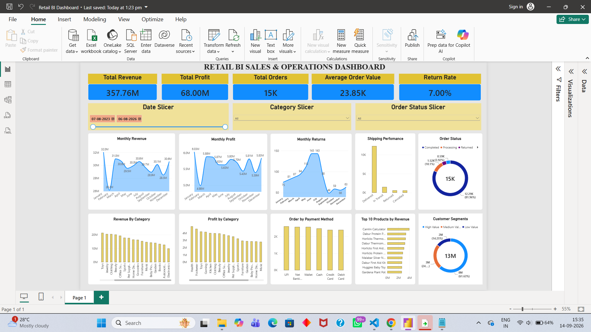

# Retail BI Analytics

An end-to-end **Business Intelligence project** that analyzes retail sales, customers, products, profitability, orders, payments, shipping, returns, and customer reviews.

This project was built from scratch using a **self-generated synthetic retail dataset** and follows a complete analytics workflow:

**Python → Data Cleaning → MySQL → SQL Analysis → Power BI Dashboard → Business Insights**

The objective of the project is to transform raw retail data into meaningful business insights that can support decisions around **revenue, profitability, customer behavior, product performance, operations, returns, and customer satisfaction**.

---

## Project Overview

The project simulates a retail business containing:

* **5,000 customers**
* **1,000 products**
* **20 product categories**
* **150 suppliers**
* **15,000 orders**
* **44,793 order items**
* **15,000 payments**
* **15,000 shipping records**
* **1,050 returns**
* **12,000 customer reviews**

The data was intentionally generated for this project rather than sourced from Kaggle or another external dataset.

The project demonstrates a complete Business Intelligence workflow, from raw data generation and cleaning through database management, SQL analysis, interactive visualization, and business recommendations.

---

## Tools & Technologies

| Tool / Technology | Purpose                                         |
| ----------------- | ----------------------------------------------- |
| **Python**        | Data generation and data cleaning               |
| **Pandas**        | Data manipulation and transformation            |
| **NumPy**         | Numerical operations and data generation        |
| **Faker**         | Synthetic customer and business data generation |
| **MySQL**         | Relational database and data storage            |
| **SQL**           | Business analysis and KPI calculation           |
| **Power BI**      | Interactive dashboard and data visualization    |
| **GitHub**        | Version control and portfolio presentation      |

### Key Python Operations

* Generated synthetic retail data using controlled randomization
* Created multiple related business tables
* Removed duplicate records
* Validated foreign-key relationships
* Converted columns to appropriate data types
* Created calculated fields such as revenue, profit, and profit margin
* Exported cleaned datasets as CSV files

### Key SQL Analysis

The SQL analysis covers:

* Customer analysis
* Product and category analysis
* Sales and revenue analysis
* Profitability analysis
* Order and payment analysis
* Shipping and delivery performance
* Returns and refunds
* Customer reviews and ratings
* Customer segmentation
* Monthly revenue growth
* Overall business KPIs

---

## Data Pipeline & Project Architecture

The project follows an end-to-end Business Intelligence pipeline:

```text
                    ┌─────────────────────┐
                    │   Python / Faker    │
                    │   Data Generation   │
                    └──────────┬──────────┘
                               │
                               ▼
                    ┌─────────────────────┐
                    │    Raw CSV Data     │
                    │     Data/Raw/       │
                    └──────────┬──────────┘
                               │
                               ▼
                    ┌─────────────────────┐
                    │   Python / Pandas   │
                    │    Data Cleaning    │
                    └──────────┬──────────┘
                               │
                               ▼
                    ┌─────────────────────┐
                    │  Cleaned CSV Data   │
                    │   Data/Cleaned/     │
                    └──────────┬──────────┘
                               │
                               ▼
                    ┌─────────────────────┐
                    │       MySQL         │
                    │    retail_bi DB     │
                    └──────────┬──────────┘
                               │
                               ▼
                    ┌─────────────────────┐
                    │    SQL Analysis     │
                    │       SQL/          │
                    └──────────┬──────────┘
                               │
                               ▼
                    ┌─────────────────────┐
                    │      Power BI       │
                    │     Dashboard       │
                    └──────────┬──────────┘
                               │
                               ▼
                    ┌─────────────────────┐
                    │ Business Insights   │
                    │ & Recommendations   │
                    └─────────────────────┘
```

### Workflow

**1. Data Generation**

Python was used to generate a realistic synthetic retail dataset containing customers, products, categories, suppliers, orders, payments, shipping records, returns, reviews, and order items.

**2. Data Cleaning**

The generated data was cleaned using Python and Pandas. The process included duplicate removal, data-type conversion, date handling, foreign-key validation, and creation of analytical fields such as revenue, profit, and profit margin.

**3. Database Loading**

The cleaned CSV files were loaded into a MySQL database named `retail_bi`.

The database contains **10 related tables** connected through primary and foreign keys.

**4. SQL Business Analysis**

SQL was used to answer business questions related to customers, products, sales, profitability, payments, shipping, returns, and reviews.

The analysis also includes:

* `JOIN`
* `GROUP BY`
* Aggregate functions
* `CASE`
* Subqueries
* Common Table Expressions (CTEs)
* Window functions
* `LAG()`
* Percentage calculations

**5. Power BI Visualization**

The MySQL database was connected to Power BI to create an interactive dashboard containing KPI cards, charts, customer segmentation, operational analysis, and interactive slicers.

**6. Business Insights**

The final analysis converts SQL and Power BI results into actionable recommendations related to profitability, customer retention, returns, product performance, and operational efficiency.

---

## Database Schema

The cleaned data is stored in a MySQL database named `retail_bi`.

The database contains **10 related tables**:

| Table         | Records | Purpose                               |
| ------------- | ------: | ------------------------------------- |
| `customers`   |   5,000 | Customer information                  |
| `categories`  |      20 | Product categories                    |
| `suppliers`   |     150 | Supplier information                  |
| `products`    |   1,000 | Product details and inventory         |
| `payments`    |  15,000 | Payment transactions                  |
| `shipping`    |  15,000 | Shipping and delivery information     |
| `orders`      |  15,000 | Customer orders                       |
| `order_items` |  44,793 | Products and quantities within orders |
| `returns`     |   1,050 | Returned orders and refunds           |
| `reviews`     |  12,000 | Customer product reviews              |

### Main Relationships

```text
customers
    │
    │ customer_id
    ▼
orders
    │
    ├──────────────► payments
    │
    ├──────────────► shipping
    │
    └── order_id ──► order_items
                         │
                         └── product_id ──► products
                                             │
                         ┌───────────────────┼──────────────────┐
                         │                   │                  │
                         ▼                   ▼                  ▼
                    categories          suppliers           reviews

orders
    │
    └── order_id ──► returns
```

### Primary Analytical Relationships

* `customers.customer_id → orders.customer_id`
* `orders.order_id → order_items.order_id`
* `products.product_id → order_items.product_id`
* `categories.category_id → products.category_id`
* `suppliers.supplier_id → products.supplier_id`
* `payments.payment_id → orders.payment_id`
* `shipping.shipping_id → orders.shipping_id`
* `orders.order_id → returns.order_id`
* `customers.customer_id → reviews.customer_id`
* `products.product_id → reviews.product_id`

---

## Data Quality & Validation

Data quality checks were performed before loading the cleaned datasets into MySQL.

### Duplicate Check

All 10 tables were checked for duplicate records.

**Result: 0 duplicate records**

### Foreign-Key Validation

Relationships between the tables were validated to identify invalid foreign-key values.

**Result: 0 invalid foreign-key records**

### Missing Values

The only significant missing values were found in:

`shipping.actual_delivery_days`

These missing values correspond to shipments where an actual delivery duration was not available, such as shipments that were still in transit or had not been successfully delivered.

This was treated as expected missing data rather than automatically replacing the values with artificial numbers.

### Calculated Analytical Fields

The cleaned `order_items` data contains additional analytical fields:

* **Revenue**

  `quantity × unit_price × (1 - discount/100)`

* **Profit**

  `revenue - quantity × cost_price`

* **Profit Margin**

  `profit / revenue × 100`

These fields were created during the Python data-cleaning process and were later used for SQL analysis and Power BI metrics.

---

## SQL Analysis

SQL was used to perform business-focused analysis across the retail database.

The analysis was divided into the following areas.

### Customer Analysis

* Customer distribution by state and city
* Customer order frequency
* Top customers by revenue, quantity, and profit
* Average Order Value
* Repeat and one-time customers
* Customer revenue segmentation
* Revenue by state and city

### Product Analysis

* Product and category performance
* Top products by quantity, revenue, and profit
* Category revenue and profitability
* Product profit margins
* Inventory and low-stock analysis
* Supplier performance
* Discount analysis

### Sales & Revenue Analysis

* Total revenue and profit
* Monthly and yearly revenue
* Monthly profit
* Average Order Value
* Revenue by order status
* Revenue by payment method
* Revenue by shipping status
* Monthly revenue growth using `LAG()`
* Daily and monthly performance analysis

### Order & Operations Analysis

* Order status distribution
* Payment success rates
* Payment method performance
* Shipping carrier performance
* Delivery status analysis
* Estimated vs actual delivery time
* Late delivery percentage
* Shipping cost analysis
* Carrier on-time performance

### Returns & Reviews Analysis

* Total returns and return rate
* Return reasons
* Refund amounts
* Monthly return trends
* Product ratings
* Rating distribution
* Category-level ratings
* Low-rated products with high sales
* Review volume analysis

---

## Key Business KPIs

The final analysis produced the following results:

| KPI                       |     Result |
| ------------------------- | ---------: |
| **Total Revenue**         |   ₹357.76M |
| **Total Profit**          |    ₹68.00M |
| **Overall Profit Margin** |     19.01% |
| **Total Orders**          |     15,000 |
| **Average Order Value**   | ₹23,850.96 |
| **Total Customers**       |      5,000 |
| **Total Products**        |      1,000 |
| **Total Returns**         |      1,050 |
| **Return Rate**           |      7.00% |
| **Total Refund Amount**   |    ₹25.43M |
| **Average Rating**        |   3.76 / 5 |
| **Total Reviews**         |     12,000 |

### Key Observations

* The business generated **₹357.76M in revenue** and **₹68.00M in profit**, resulting in a **19.01% profit margin**.
* The average order value was **₹23,850.96** across 15,000 orders.
* The business had **5,000 customers and 15,000 orders**, providing an opportunity to strengthen customer retention and loyalty.
* **1,050 orders were returned**, resulting in a **7.00% return rate**.
* Total refunds amounted to approximately **₹25.43M**, making return reduction an important profitability opportunity.
* The dataset contains **12,000 reviews** with an average rating of **3.76/5**, providing useful signals for evaluating customer satisfaction and product quality.

---

## Power BI Dashboard

The final Power BI dashboard provides an interactive overview of the retail business and allows users to explore sales, profitability, customers, orders, shipping, and returns.

### Dashboard KPIs

The dashboard includes:

* **Total Revenue:** ₹357.76M
* **Total Profit:** ₹68.00M
* **Total Orders:** 15,000
* **Average Order Value:** ₹23,850.96
* **Return Rate:** 7.00%

### Dashboard Visualizations

The dashboard contains:

* Monthly Revenue Trend
* Monthly Profit Trend
* Monthly Returns
* Revenue by Category
* Profit by Category
* Top 10 Products by Revenue
* Order Status Distribution
* Orders by Payment Method
* Shipping Performance
* Customer Segments

### Interactive Filters

The dashboard includes slicers for:

* **Date Range**
* **Category**
* **Order Status**

These filters allow users to interactively explore different portions of the retail data.

### Power BI Data Model

The dashboard uses a relational data model connecting the major business entities.

The primary analytical path is:

```text
Customers → Orders → Order Items → Products → Categories
```

with additional relationships to:

* Payments
* Shipping
* Returns
* Reviews
* Suppliers

This model allows Power BI to aggregate and filter data across multiple business dimensions.

### Dashboard Preview



---

## Key Business Insights & Recommendations

The analysis of the retail dataset produced several important business insights.

### 1. Strong Overall Profitability

The business generated approximately **₹357.76M in revenue** and **₹68.00M in profit**, resulting in an overall profit margin of **19.01%**.

**Recommendation:**
Continue monitoring product-level and category-level margins to identify opportunities for improving profitability while maintaining competitive pricing.

### 2. High Average Order Value

The average order value was approximately **₹23,850.96** across 15,000 orders.

**Recommendation:**
Use cross-selling, product bundles, and targeted promotions to increase the value of individual customer purchases.

### 3. Customer Retention Opportunity

The dataset contains **5,000 customers and 15,000 orders**, representing approximately **3 orders per customer** on average.

**Recommendation:**
Strengthen customer retention through loyalty programs, personalized offers, and targeted campaigns for repeat purchases.

### 4. Returns Impact Profitability

There were **1,050 returned orders**, resulting in a **7.00% return rate**. Total refunds amounted to approximately **₹25.43M**.

**Recommendation:**
Investigate the major causes of returns and focus on reducing avoidable returns through better product descriptions, quality control, accurate product information, and improved fulfillment processes.

### 5. Customer Reviews Provide Product Quality Signals

The dataset contains **12,000 customer reviews** with an average rating of **3.76 out of 5**.

**Recommendation:**
Use review ratings together with sales performance to identify products that generate strong sales but have lower customer satisfaction. These products should be prioritized for quality and customer-experience improvements.

### 6. Optimize Operational Performance

Shipping, payment, and order-status analysis provides visibility into operational performance across the retail business.

**Recommendation:**
Monitor delivery times, late deliveries, payment success rates, and shipping costs to identify operational bottlenecks and improve the overall customer experience.

### Overall Business Recommendation

The analysis suggests that the business should focus on **protecting profit margins, increasing customer retention, reducing avoidable returns, improving product quality, and optimizing operational efficiency**.

The combination of SQL analysis and the Power BI dashboard provides a foundation for supporting **data-driven business decision-making**.

---

## Project Structure

```text
retail BI analytics/
│
├── Data/
│   ├── Raw/
│   │   └── Raw generated CSV files
│   │
│   └── Cleaned/
│       └── Cleaned and analysis-ready CSV files
│
├── images/
│   └── retail_bi_dashboard.png
│
├── Power BI/
│   └── dashboard.pbix
│
├── Python/
│   ├── generate_data.py
│   └── clean_data.py
│
├── SQL/
│   ├── schema.sql
│   ├── load_data.sql
│   └── analysis.sql
│
└── README.md
```

### Folder & File Description

| Folder / File             | Description                                             |
| ------------------------- | ------------------------------------------------------- |
| `Data/Raw/`               | Original synthetic datasets generated using Python      |
| `Data/Cleaned/`           | Cleaned datasets used for database loading and analysis |
| `images/`                 | Dashboard screenshots used in the README                |
| `Power BI/`               | Power BI dashboard file                                 |
| `Python/generate_data.py` | Generates the synthetic retail dataset                  |
| `Python/clean_data.py`    | Cleans and transforms the generated data                |
| `SQL/schema.sql`          | Creates the database tables and relationships           |
| `SQL/load_data.sql`       | Loads cleaned CSV data into MySQL                       |
| `SQL/analysis.sql`        | Contains business analysis queries and KPI calculations |
| `README.md`               | Project documentation                                   |

---

## How to Run the Project

### 1. Generate the Dataset

Navigate to the Python folder and run:

```bash
python generate_data.py
```

This generates the raw synthetic retail datasets inside:

```text
Data/Raw/
```

### 2. Clean the Data

Run:

```bash
python clean_data.py
```

The cleaned datasets are generated inside:

```text
Data/Cleaned/
```

### 3. Create the MySQL Database

Open MySQL Workbench and run the SQL script:

```text
SQL/schema.sql
```

This creates the `retail_bi` database and its tables.

### 4. Load the Cleaned Data

Run the SQL loading script:

```text
SQL/load_data.sql
```

This loads the cleaned CSV files into the corresponding MySQL tables.

### 5. Perform SQL Analysis

Open:

```text
SQL/analysis.sql
```

Run the queries in MySQL Workbench to reproduce the customer, product, sales, operations, returns, reviews, and KPI analysis.

### 6. Open the Power BI Dashboard

Open the Power BI file located in:

```text
Power BI/
```

Connect Power BI to the MySQL `retail_bi` database and refresh the data if required.

---

## Key Learning Outcomes

This project provided practical experience with:

* Synthetic data generation
* Data cleaning and preprocessing
* Relational database design
* Primary and foreign keys
* MySQL database management
* SQL joins and aggregations
* Subqueries and CTEs
* Window functions
* `LAG()` for growth analysis
* KPI development
* Data modeling in Power BI
* DAX measures
* Interactive dashboards
* Business analysis
* Data-driven recommendations

---

## Limitations

This project uses a **self-generated synthetic dataset**, so the results do not represent the performance of a real retail company.

The dataset is designed to simulate realistic business relationships and analytical scenarios for learning and portfolio purposes.

Additionally, the `returns` table is associated with orders rather than individual products. Therefore, product-level return attribution is limited when an order contains multiple products.

---

## Future Improvements

Potential future enhancements include:

* Adding a more advanced customer segmentation model such as RFM analysis
* Building a dedicated inventory dashboard
* Adding forecasting for revenue and demand
* Implementing automated data pipelines
* Adding more advanced DAX measures
* Creating drill-through Power BI pages
* Adding geographic sales analysis
* Improving return analysis with product-level return data
* Automating database refresh and dashboard updates
* Deploying the dashboard to Power BI Service

---

## Conclusion

This project demonstrates a complete **end-to-end Business Intelligence workflow** using Python, MySQL, SQL, and Power BI.

Starting from self-generated raw data, the project progresses through data cleaning, relational database management, business-focused SQL analysis, interactive dashboard development, and actionable business recommendations.

The project highlights how raw data can be transformed into meaningful insights that support decisions related to **sales, profitability, customers, products, operations, returns, and customer satisfaction**.

**Tech Stack:** Python • Pandas • NumPy • Faker • MySQL • SQL • Power BI
